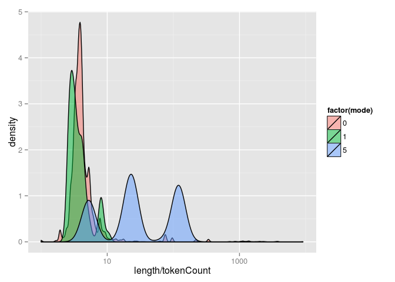
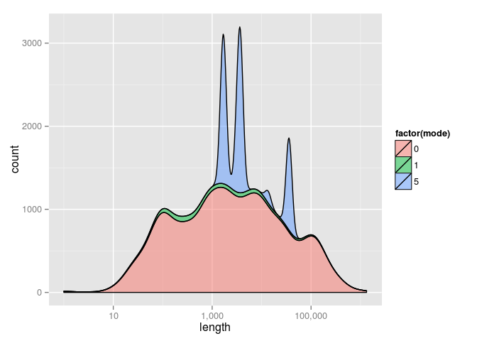
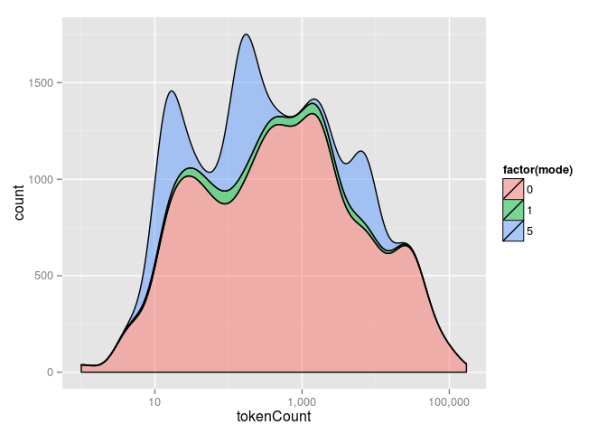
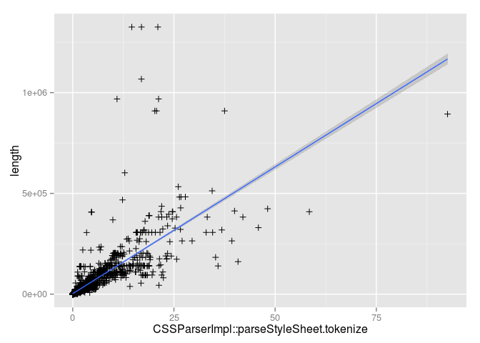
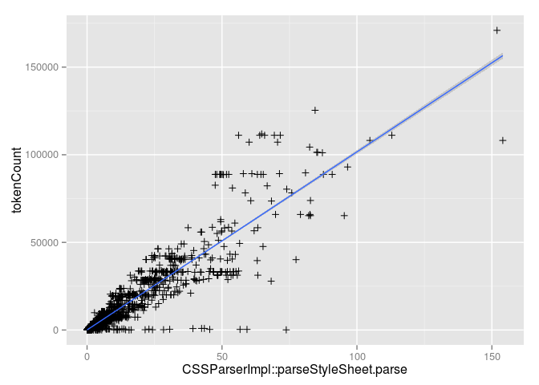

Based on 4734 observations.

`CSSTokenizer` allocates a vector with space for `length / 3` tokens. 8.24% of the time the allocated vector is too small and needs to be resized.

In the cases where more space was allocated than necessary, half the observations saw over-allocation by more than 8960 `CSSParserTokens`. The worst case, <https://leanpub.com/fonts/314471/50F059BA854EE979B.css>, over-allocated by 441426 `CSSParserTokens`.

``` r
tokens_per_character <- cssparser$length / cssparser$tokenCount
quantile(tokens_per_character, c(0.25, 0.75, 0.90, 0.95, 0.99, 1))
```

    ##         25%         75%         90%         95%         99%        100% 
    ##    3.481056    5.381703   23.717949  119.857143  217.292768 9120.179487

16.9% of sheets parsed were useragent sheets.

``` r
ua_sheets <- cssparser[cssparser$mode == 5, ]
tokens_per_character <- ua_sheets$length / ua_sheets$tokenCount
sort(unique(tokens_per_character))
```

    ## [1]   5.148530   5.583675   9.509225  19.457317  23.717949  67.888889
    ## [7] 119.857143

    
