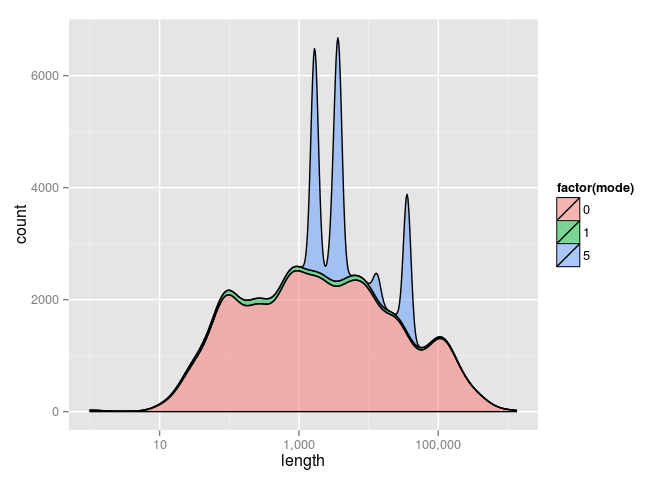
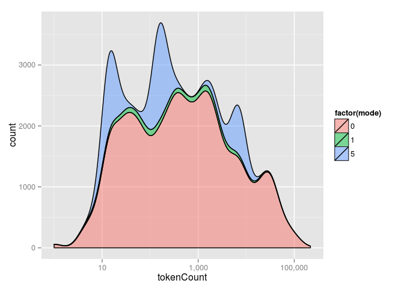
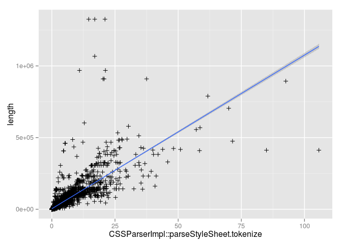

Based on 9394 observations.

`CSSTokenizer` allocates a vector with space for `length / 3` tokens. 8.6% of the time the allocated vector is too small and needs to be resized.

In the cases where more space was allocated than necessary, half the observations saw over-allocation by more than 8200 `CSSParserTokens`. The worst case, <https://leanpub.com/fonts/314471/50F059BA854EE979B.css>, over-allocated by 441426 `CSSParserTokens`.

``` r
characters_per_token <- cssparser$length / cssparser$tokenCount
quantile(characters_per_token, c(0.25, 0.75, 0.90, 0.95, 0.99, 1))
```

    ##         25%         75%         90%         95%         99%        100% 
    ##    3.463768    5.444008   23.717949  119.857143  119.857143 9120.179487

16.8% of sheets parsed were useragent sheets representing 5.85% of time in the parser.

``` r
ua_sheets <- cssparser[cssparser$mode == 5, ]
characters_per_token <- ua_sheets$length / ua_sheets$tokenCount
sort(unique(characters_per_token))
```

    ##  [1]   3.543981   5.148116   5.148530   5.150697   5.583675   6.048432
    ##  [7]   6.049354   9.509225  19.457317  20.153846  23.717949  67.888889
    ## [13] 119.857143

    
