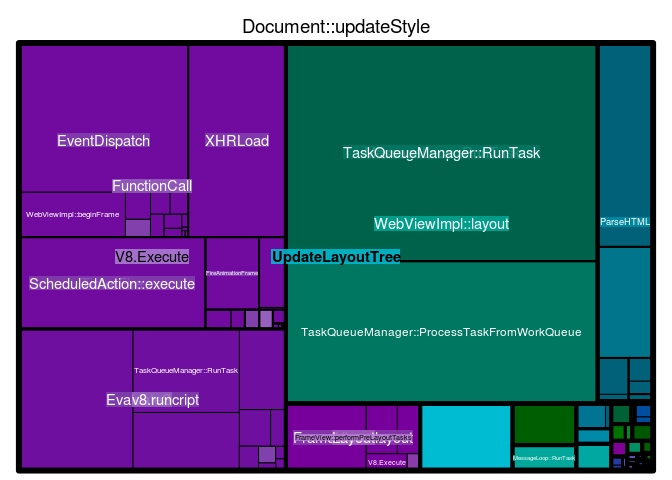
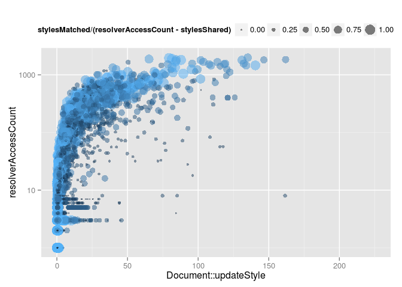
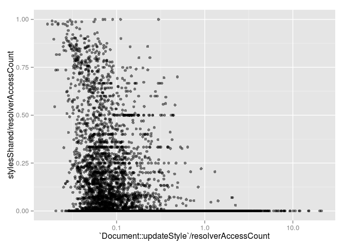
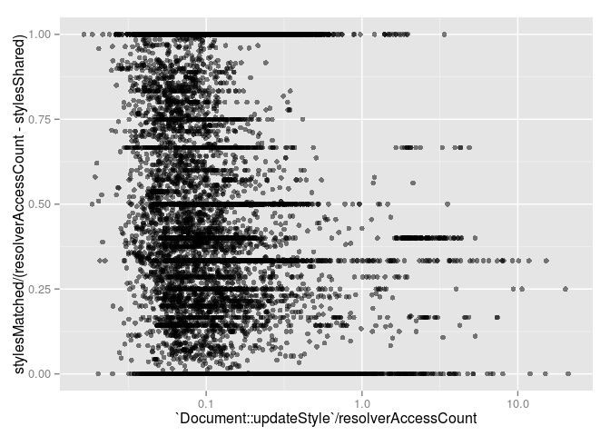
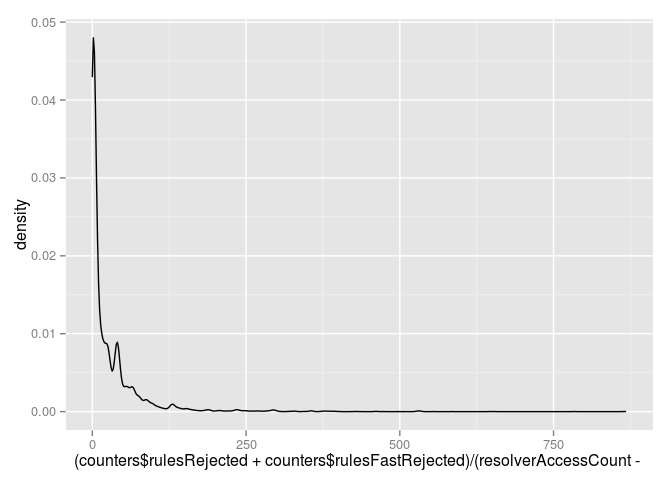
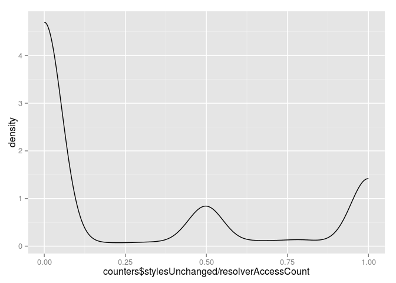

Based on 24846 `Document::updateStyle` observations.

Callers of Document::updateStyle
--------------------------------

There were 332 unique trace stacks. 46.08% of stacks and 42.75% of thread time involves `V8.Execute`.

Style Sharing
-------------

Style sharing rate: 18.37%

  

Matched properties cache
------------------------

Non-inherited hit rate: 63.5%

Inherited hit rate: 37.64%

  

Rules matched / rejected
------------------------

Of the rules considered:

-   6.9% matched
-   69.13% were rejected by the bloom filter
-   23.97% were rejected by evaluation

  

Styles un/changed
-----------------

Warning: This section isn't entirely accurate yet.

Based on 9910 `Document::updateStyle` observations.

23.78% of styles produced were identical to the previous state.

