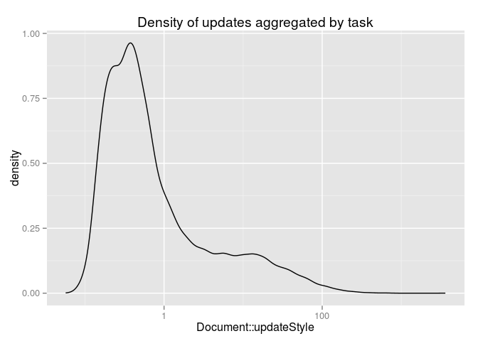
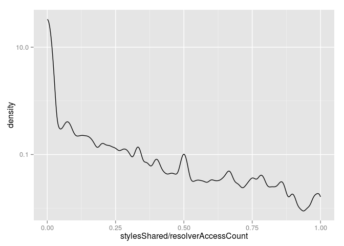
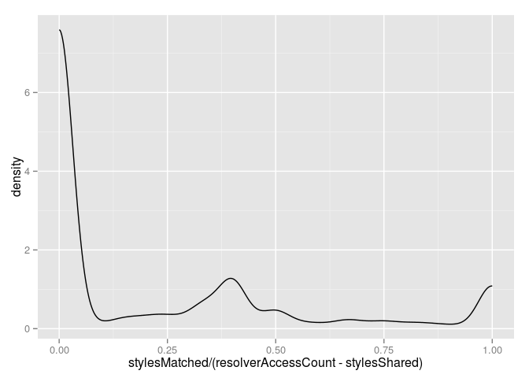
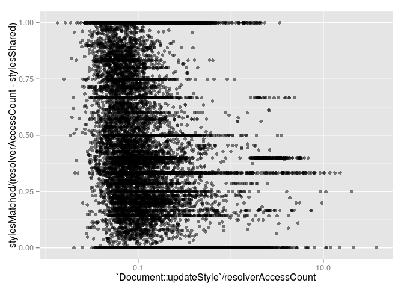

Based on 50380 `Document::updateStyle` observations over 1200 runs.

Style update
------------

  

Rail
----

Found 4880 RAIL interaction records. 27.36% of observations were not classified:

-   229 response
-   232 animate
-   2099 idle
-   2320 load

Individual observations:

Aggregated by RAIL iteraction record:

Callees
-------

4.71% of thread time spent in traced children.

Callers
-------

There were 511 unique trace stacks. 39.65% of stacks and 44.25% of thread time involves `V8.Execute`.

Style Sharing
-------------

Style sharing rate: 18.25%

  

Matched properties cache
------------------------

Non-inherited hit rate: 61.35%

Inherited hit rate: 36.66%

  

Rules matched / rejected
------------------------

Of the rules considered:

-   7.13% matched
-   68.26% were rejected by the bloom filter
-   24.61% were rejected by evaluation

  

Styles un/changed
-----------------

Warning: This section isn't entirely accurate yet.

Based on 34751 `Document::updateStyle` observations.

17.57% of styles produced were identical to the previous state.

