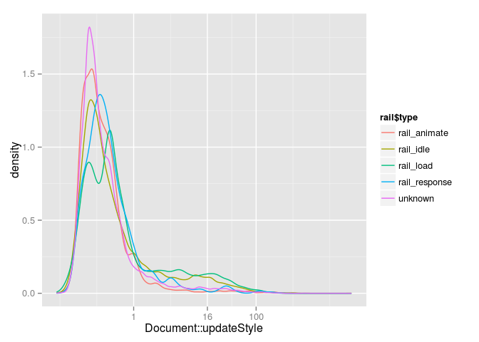
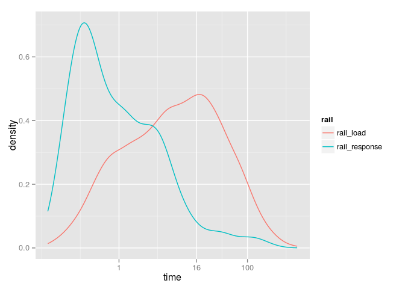

Based on 24846 `Document::updateStyle` observations.

Callers of Document::updateStyle
--------------------------------

There were 332 unique trace stacks. 46% of stacks and 43% of thread time involves `V8.Execute`.

Style Sharing
-------------

  

Matched properties cache
------------------------

  
