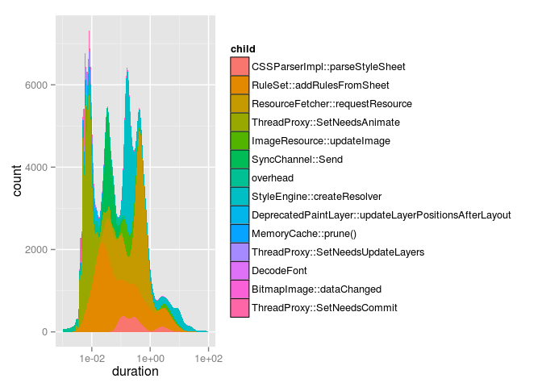
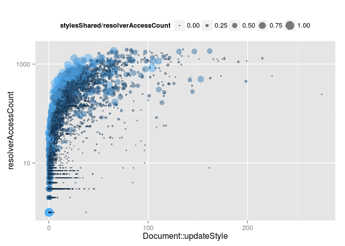
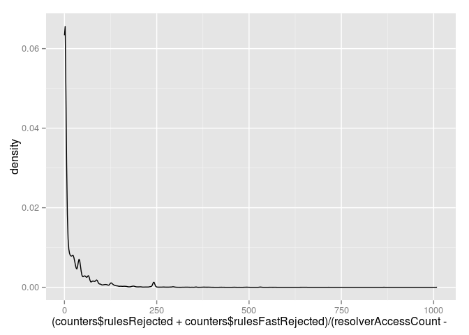

Based on 28202 `Document::updateStyle` observations over 801 runs.

Style update
------------

  

Rail
----

Found 3266 RAIL interaction records. 18.55% of observations were not classified:

-   214 response
-   211 animate
-   1387 idle
-   1454 load

Individual observations:

Aggregated by RAIL iteraction record:

Callees
-------

2.3% of thread time spent in traced children.

Callers
-------

There were 361 unique trace stacks. 45.73% of stacks and 42.61% of thread time involves `V8.Execute`.

Style Sharing
-------------

Style sharing rate: 19.4%

  

Matched properties cache
------------------------

Non-inherited hit rate: 62.93%

Inherited hit rate: 37.04%

  

Rules matched / rejected
------------------------

Of the rules considered:

-   6.97% matched
-   68.85% were rejected by the bloom filter
-   24.18% were rejected by evaluation

  

Styles un/changed
-----------------

Warning: This section isn't entirely accurate yet.

Based on 12589 `Document::updateStyle` observations.

20.69% of styles produced were identical to the previous state.

